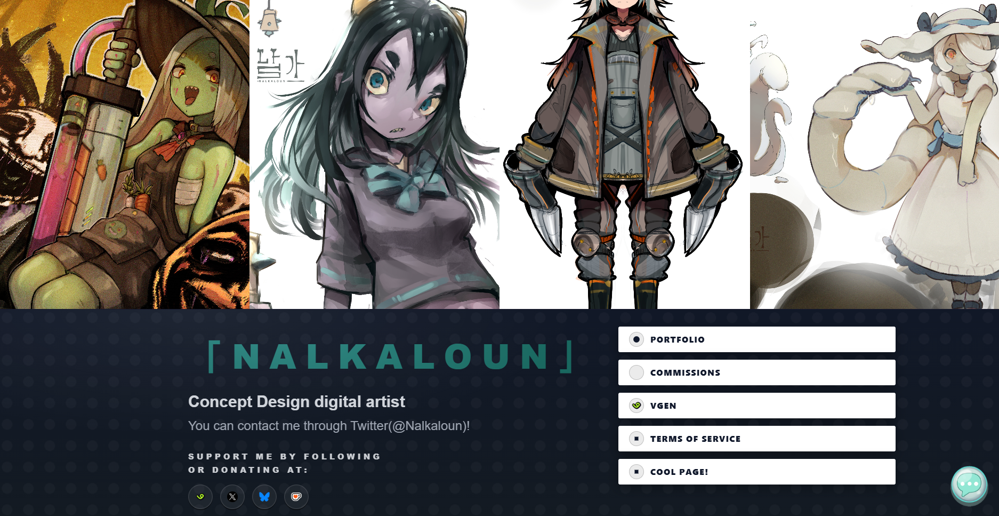
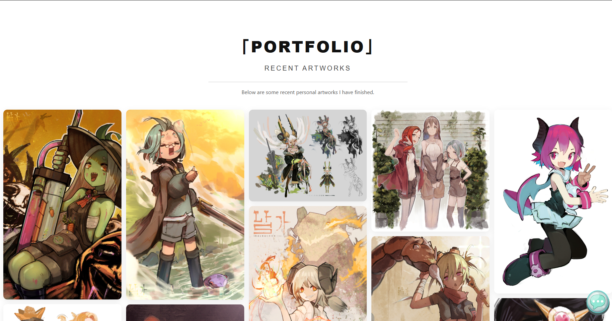
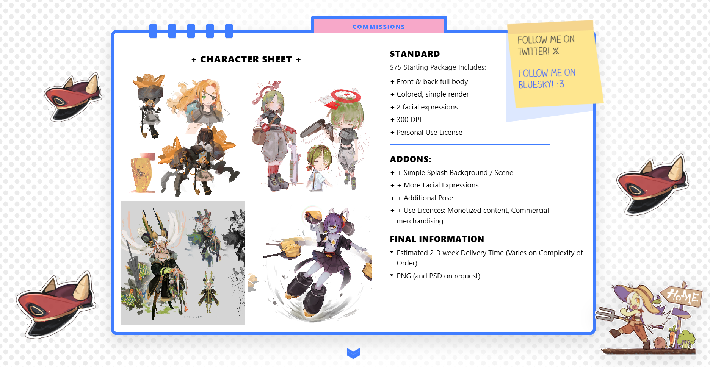
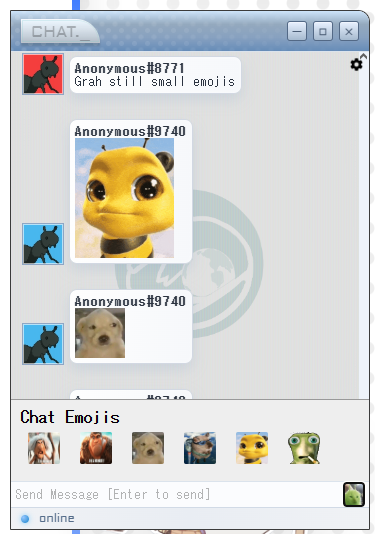
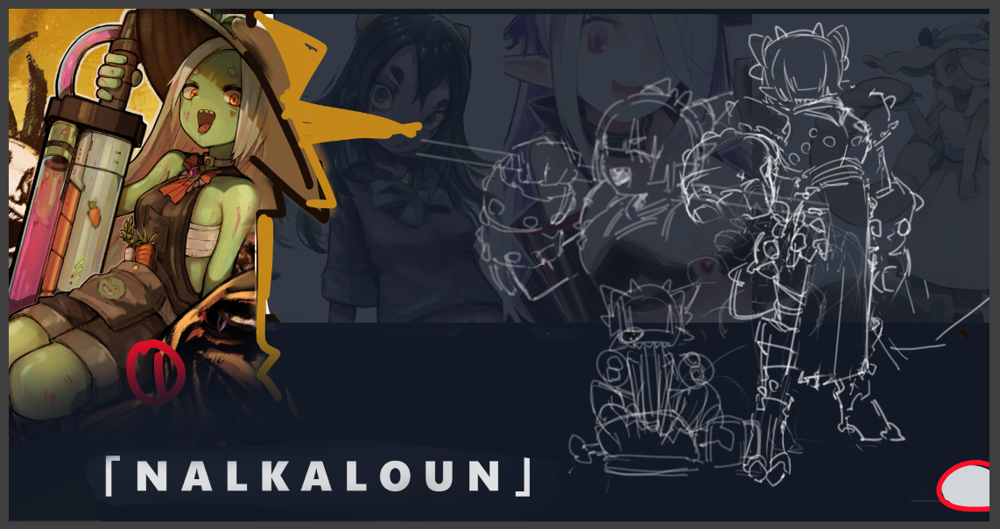
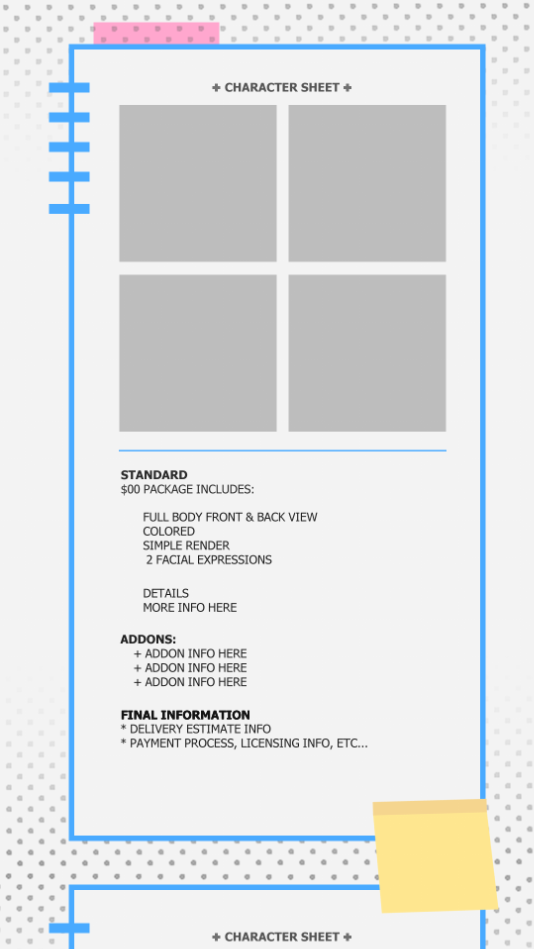
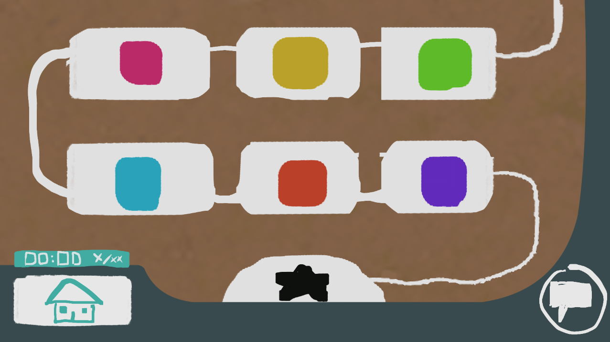

# Nalkaloun Portfolio

**Nalkaloun Portfolio** is a personal art and development website built to showcase the work of **Nalkaloun**, an independent digital artist and character designer.  
It functions as a custom-designed interactive portfolio that showcases Nalkalouns style and character. (plz commission him hes awesome!)

**Website:** [https://nalkaloun.art](https://nalkaloun.art)  

---

## Purpose

This project was created to provide a space that fully represents the artist’s work and personality.

The portfolio serves as:
- A dynamic art gallery that highlights selected works
- A commissions page where visitors can learn about custom projects
- A live chat window that allows direct communication with the artist and other people in the community
- A Terms of Service page that allows other users to have a better understanding of the commission terms and rates

---

## Visual Overview

---

## Technical Overview

The website is built using a modern, lightweight stack focused on performance and tailored to the clients budget.

| Area | Technology |
|------|-------------|
| Framework | React (Vite) |
| Styling | Plain CSS (no Tailwind) |
| Chat Integration | [Chattable](https://iframe.chat) |
| Hosting | Cloudflare |
| Analytics | Google Analytics |
more tools to be added soon! for more user interaction :3

---

## Design Direction

The design of this portfolio focuses on minimalism and responsiveness.  

**Principles:**
- Clean and distraction-free interface  
- Smooth transitions and light motion  
- Quick and resourceful rendering of high quality images
- Responsive layout for different devices

---

## Goals and Future Direction

Planned updates and improvements include:
- Embedded analytics dashboard for visits
- Light/dark theme toggle  
- Gesture-based mobile navigation  (!!)
- Playlist sharing!
- Stuff page having more games
- Potential OC page
- Cool transition for characters on the landing page (similar to character select in games)

**Screenshot placeholder:**  

---

## About the Artist

**Nalkaloun** is a digital artist and developer exploring the connection between creativity and technology.  
This portfolio reflects that balance — it’s a personal website, an art space, and a technical experiment.

**Website:** [https://nalkaloun.art](https://nalkaloun.art)  
**Contact:** ([nalka-vgen](https://vgen.co/Nalkaloun))

---

## License

All artwork and code © Nalkaloun.  
Do not redistribute or reuse without permission.

---
